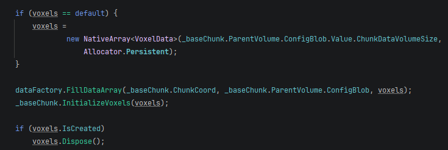

# Custom Data Generation

A small Library of data generation assets is provided in [data-factory.md](../getting-started/beginner-guide/simple-chunk/data-factory.md "mention"), and a much larger and more performant Library of assets is provided in [pro-version.md](../getting-started/pro-version.md "mention").\
\
However, if you want to implement your own data generation, you can extend [data-factory.md](../getting-started/beginner-guide/simple-chunk/data-factory.md "mention"), or you can write something completely new. The only requirement is that when initializing your [ichunk](ichunk/ "mention"), you must call InitializeVoxels on the baseChunk and pass a NativeArray of VoxelDatas, representing the Voxels in the Chunk, flattened into a 1-Dimensional NativeArray. The size of the NativeArray is derived from [voxel-volume-config.md](../getting-started/beginner-guide/simple-volume/voxel-volume-config.md "mention")but you access it from the ConfigBlob in [ivolume](ivolume/ "mention"). The following code snippet shows an example:\
 

<figure><figcaption></figcaption></figure>

Custom Data Generation will require utilizing [mcstatichelper.md](mcstatichelper.md "mention") to convert between 3-Dimentional coordinates and flattened 1-Dimensional Indices.&#x20;
