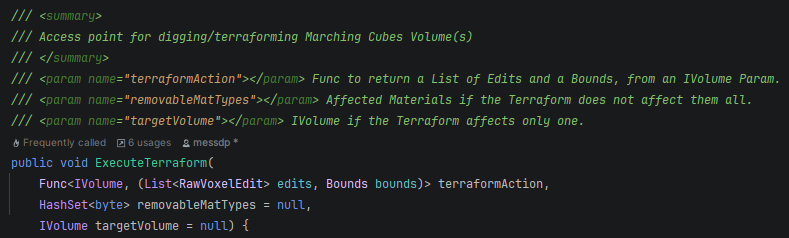

# Custom Terraforming Commands

A small Library of Terraforming Commands is provided by [sbvoxel-commands.md](../getting-started/beginner-guide/sbvoxel-commands.md "mention"), and a much larger Library of Commands is provided by [pro-version.md](../getting-started/pro-version.md "mention").\
\
However, if you want to implement your own custom commands, they must be compatible with the public method in[marching-cubes-manager](../getting-started/beginner-guide/marching-cubes-manager/ "mention"), ExecuteTerraform:

<figure><figcaption></figcaption></figure>

Refer to [sbvoxel-commands.md](../getting-started/beginner-guide/sbvoxel-commands.md "mention")and it's static helper class TerraformCommands for examples of how to write methods that suit the Func parameter.&#x20;
