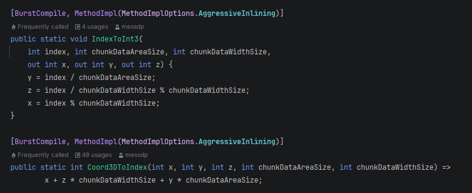

# McStaticHelper

McStaticHelper is a static class with critical helper methods for advanced users. Most importantly, the following methods for converting between a 3-Dimensional coordinate, and a flattened 1-Dimensional Index.&#x20;

<figure><figcaption></figcaption></figure>
