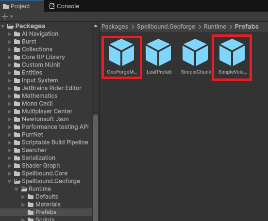
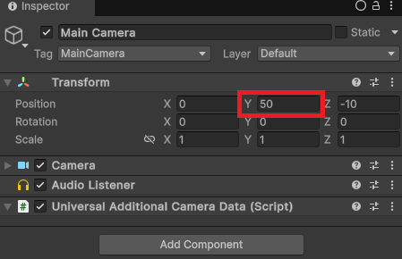
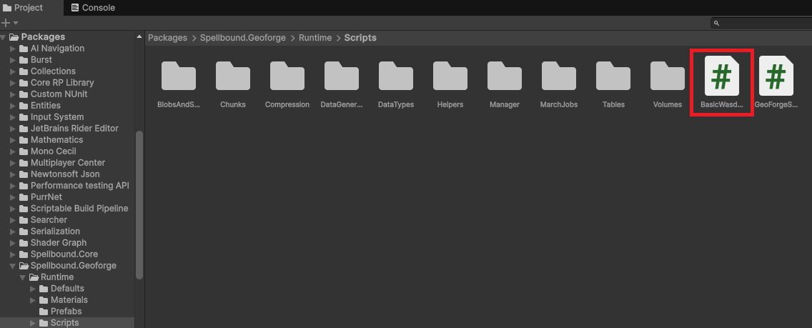
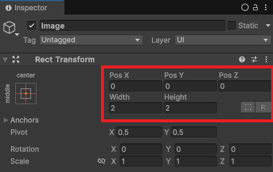
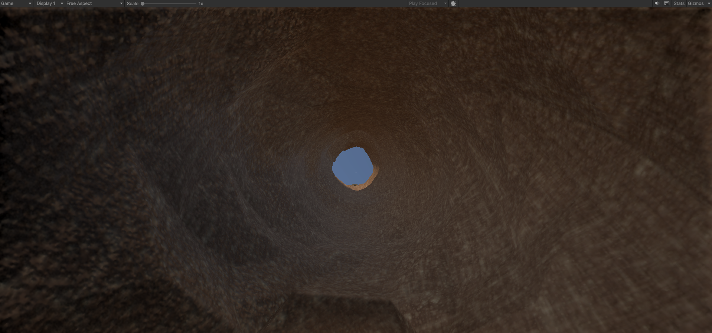

# QuickStart

Import any one of Package's Samples, or if you would like to set up a brand new scene yourself, follow the instructions below.

1. Open a new scene or open the scene in which you want to try using GeoForge.&#x20;
2.  Locate the Prefabs Folder and drag the [geoforgemanager](beginner-guide/geoforgemanager/ "mention") and the [simplevolume](beginner-guide/simplevolume/ "mention") Prefabs into the scene. These Prefabs should have all the required fields already assigned.&#x20;

    <figure><figcaption></figcaption></figure>
3.  Move the main camera in the scene up to about y = 50 to ensure it's not inside the terrain that will be generated.&#x20;

    <figure><figcaption></figcaption></figure>
4.  Locate the Scripts Folder and drag the script BasicWasdController onto the main camera. This script will let you fly the camera around like it's your character.&#x20;

    <figure><figcaption></figcaption></figure>
5.  (OPTIONAL) RightClick Create > UI > Image, and set the transform as shown below. This places a simple square crosshair in the middle of your screen to visualize where digging and terraforming operations are aimed.&#x20;

    <figure><figcaption></figcaption></figure>
6.  Enter Play Mode and try digging and terraforming the terrain using keybinds 1 to dig, and 2 to deposit material. Dig tunnels, build columns, etc.

    <figure><figcaption></figcaption></figure>

 

\
 
