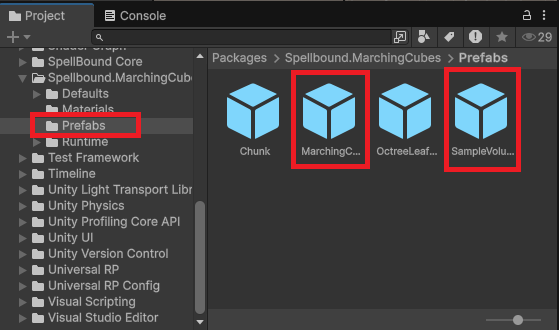
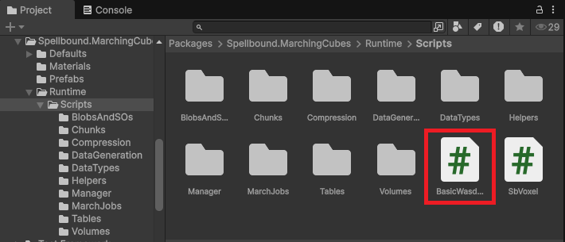

# QuickStart

1.  Locate the Prefabs Folder and drag the [marching-cubes-manager](beginner-guide/marching-cubes-manager/ "mention") and the [simple-volume](beginner-guide/simple-volume/ "mention") Prefabs into the scene.&#x20;

    <figure><figcaption></figcaption></figure>
2.  Locate the MainCamera in the scene and add the component "BasicWasdController" to it. Change it's initial transform position to (0, 40, -40) to not be "inside" the mesh that will be generated.

    <figure><figcaption></figcaption></figure>
3.  (OPTIONAL) RightClick > UI > Image, and set the transform as shown below. This places a simple square crosshair in the middle of your screen to visualize where digging and terraforming operations are aimed/

    <figure><figcaption></figcaption></figure>
4. Now you're all set to enter play mode and fly around the scene modifying the SampleVolume with keybinds 1 , 2,  and 3. See what you can tweak in this minimal setup, and consult the documentation for the full package capabilities.&#x20;

 

\
 
