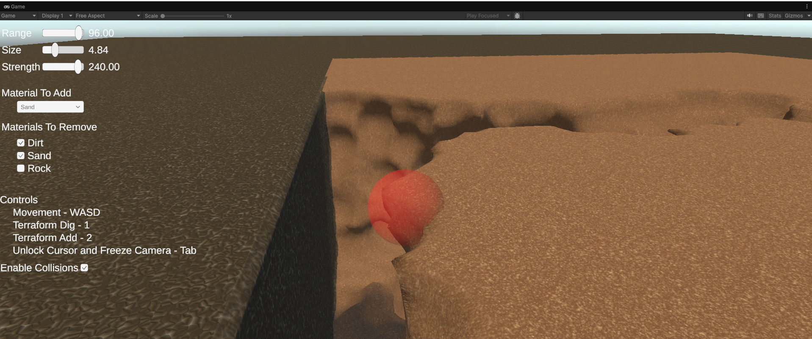

# Digging a Hole

This sample showcases the basic functionary of GeoForge. There was a very successful indie game - if not more than one - that was fundamentally about digging a big hole in your backyard. If you want to make something similar yourself, this is a great starting point.\
\
The [volume.md](../terminology/volume.md "mention")is a [simplevolume](../getting-started/beginner-guide/simplevolume/ "mention"), the [chunk.md](../terminology/chunk.md "mention")is a [simplechunk.md](../getting-started/beginner-guide/simplechunk.md "mention"). The [data-factory.md](../getting-started/beginner-guide/simplevolume/data-factory.md "mention")simply makes every [voxel.md](../terminology/voxel.md "mention")full density and the  [boundary-overrides.md](../getting-started/beginner-guide/simplevolume/boundary-overrides.md "mention")is "Bore" which keeps the bottom and side faces of the [volume.md](../terminology/volume.md "mention")full density and the top face empty. These settings create the circumstances for digging a hole; the [volume.md](../terminology/volume.md "mention")is like an untouched tub of icecream; you can only dig in from the top, and if you dig to the edge of the icecream you bump into the sides of the container, preventing you from digging any further. \
\
The [volume.md](../terminology/volume.md "mention")is 128 x 128 units across, and 1024 units deep.&#x20;

<figure><figcaption></figcaption></figure>

