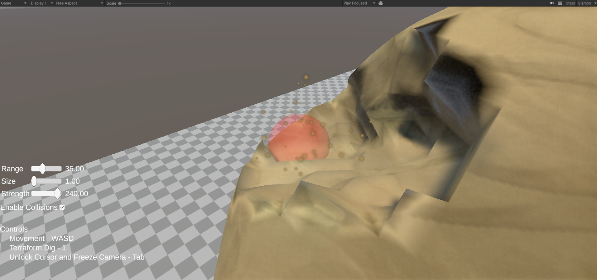

# Mining Ore Veins

This sample demonstrates a custom implementation of [ichunk](../advanced-usage/ichunk/ "mention"). The [volume.md](../terminology/volume.md "mention")is a [simplevolume](../getting-started/beginner-guide/simplevolume/ "mention"), but the [chunk.md](../terminology/chunk.md "mention")does not apply Terraforming directly, and instead simulates each [voxel.md](../terminology/voxel.md "mention")having a large health pool. While it has "health", nothing about the mesh changes, but when the damage exceeds the size of the health pool, the [voxel.md](../terminology/voxel.md "mention") goes straight to empty, to zero density.\
\
It demonstrates a kind of ore vein or rock quarry, where part of a game might be to mine these things for resources.\
\
A sound and a particle effect are included in the Sample because if the mesh does not discernably change, it would be confusing and disorienting if there was not some kind of feedback that the player's "mining" was working correctly. \
\
The  [boundary-overrides.md](../getting-started/beginner-guide/simplevolume/boundary-overrides.md "mention") is "AllEmpty" which keeps the entire [volume.md](../terminology/volume.md "mention")surrounded by empty [voxel.md](../terminology/voxel.md "mention")s to create a closed 3D shape. The [data-factory.md](../getting-started/beginner-guide/simplevolume/data-factory.md "mention")creates a "Noisy Sphere" of radius 7 units. \
\
The [volume.md](../terminology/volume.md "mention")is 16 x 16 x 16 units, and has a fine resolution of 0.25 units per [voxel.md](../terminology/voxel.md "mention").&#x20;

<figure><figcaption></figcaption></figure>

