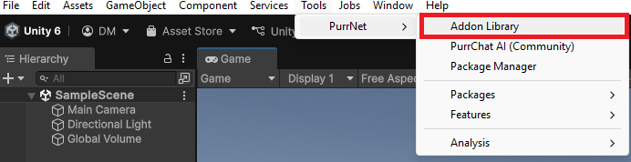
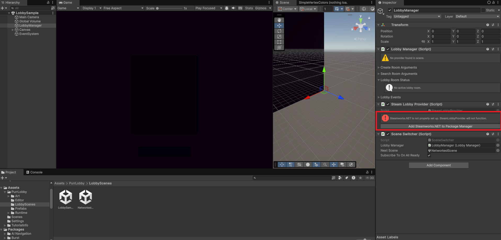
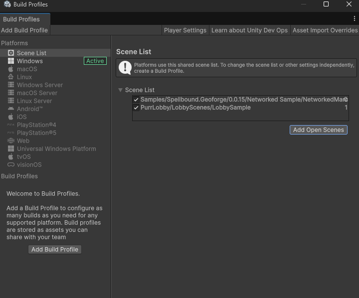
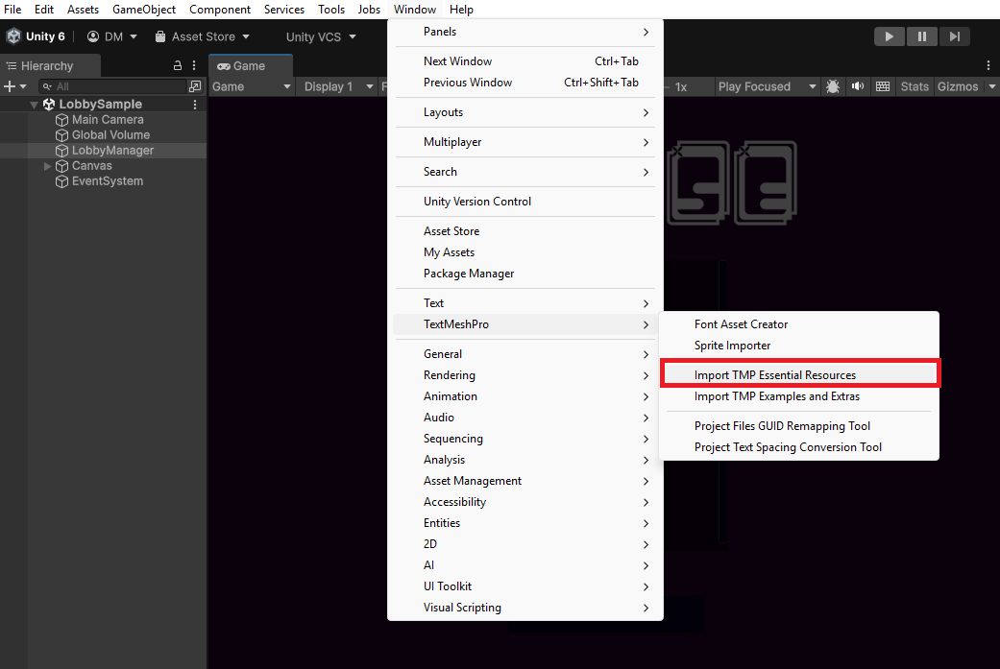

# Networked Sample

This sample is a networked version of [digging-a-hole.md](digging-a-hole.md "mention").

It utilizes PurrNet, which is a free networking solution for unity. If you have used PurrNet and the PurrNet Lobby before, you can likely figure out how to get this sample to run yourself. But if you are new to PurrNet or having any trouble, follow the steps below.

1. If GeoForge is not installed yet, install it as described in [installation.md](../getting-started/installation.md "mention").
2. Install PurrNet thru GitHub or thru the Unity Asset Store here [https://purrnet.gitbook.io/docs/](https://purrnet.gitbook.io/docs/). The exact git URL is [https://github.com/PurrNet/PurrNet.git?path=/Assets/PurrNet#release](https://github.com/PurrNet/PurrNet.git?path=/Assets/PurrNet#release).
3. (OPTIONAL) You may have to restart Unity at this point if you're getting errors.
4.  Click Tools > PurrNet > Addon Library, and install PurrNet Lobby. Import it all.&#x20;

    <figure><figcaption></figcaption></figure>
5.  Click on the LobbySample Scene in the PurrLobby Folder.&#x20;

    <figure><figcaption></figcaption></figure>
6.  In the LobbySample Scene, click on the LobbyManager, and click on the "add Steamworks.Net button".&#x20;

    <figure><figcaption></figcaption></figure>
7. In the Package Manager, under Spellbound.GeoForge, navigate to the Samples tab, and import the Networked Sample.&#x20;
8. Back in the LobbyManager enable "Handle Steam Init", disabled "Subscribe To On All Ready", and drag the Scene from the GeoForge Networked Sample into the "Next Scene" field.&#x20;
9.  Click File > Build Profiles, and add the LobbyManager Scene to the Scene List.&#x20;

    <figure><figcaption></figcaption></figure>
10. Import TextMeshPro Essentials.&#x20;

    <figure><figcaption></figcaption></figure>
11. Make sure Steam is running in the background on your computer.
12. Create a Lobby. Share the room code with a friend, or play the sample alone. Click "Ready" and enter the scene.&#x20;
